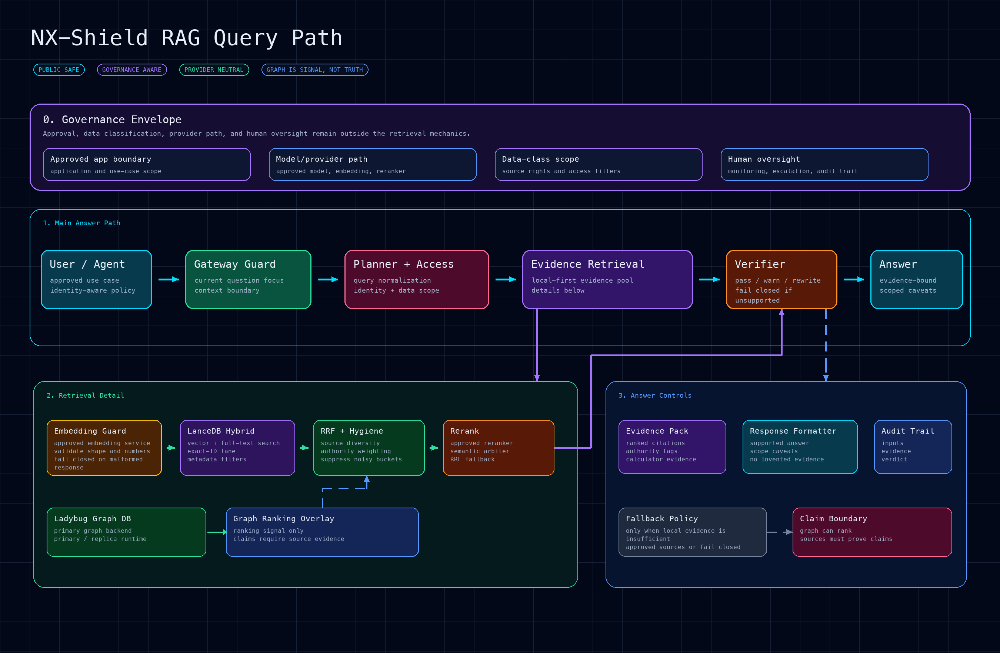
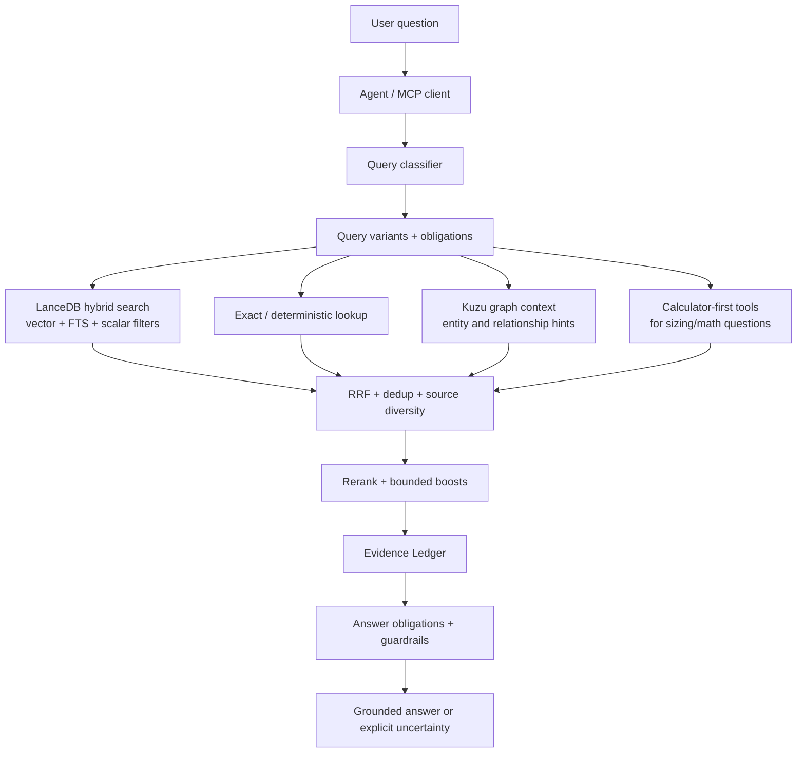

# NX-Shield RAG

**A field-tested design for building a trustworthy enterprise RAG system — not just a vector search demo.**

NX-Shield RAG is a public design notebook for a Nutanix-focused retrieval-augmented generation system. The implementation is private, but the architecture is documented here so other teams can copy the patterns: hybrid retrieval, source authority, graph context, calculator-first tooling, evidence-ledger answer synthesis, and profile-aware MCP serving.

> If you only remember one idea: **retrieval is not the product; evidence-bound answers are the product.**

## Why this repo exists

Most RAG examples stop at "embed documents and ask questions." That is not enough for technical support, presales, or partner-facing answers where hallucinations can cause real operational damage.

This repo documents how NX-Shield RAG is designed to answer questions with:

- **traceable evidence** instead of ungrounded prose,
- **multiple retrieval channels** instead of one vector lookup,
- **source authority and access policy** instead of a flat document pile,
- **calculator/tool-first paths** when deterministic math beats language-model guessing,
- **graph context** as structural signal, not as a replacement for evidence,
- **MCP service boundaries** so multiple agents can share the same RAG safely,
- **rebuild discipline** so the system can be recreated from private source and public docs.

## Sample query path

Example user question:

> Can you provide a detailed comparison of VMware Cloud Foundation (VCF) 9.1 and Nutanix AOS 7.5?



This is a comparison query, so the RAG path is deliberately different from a single factual lookup. The goal is not only to retrieve chunks, but to produce balanced evidence for both products and make weak coverage visible before answer generation.

### 1. Classify and plan

- Run a prompt-injection guard before retrieval.
- Detect explicit comparison intent from markers such as `vs`, `versus`, `compare`, `comparison`, or `difference between`.
- Extract search-only product/version aliases such as `VCF 9.1`, `VMware Cloud Foundation`, `Broadcom`, `AOS 7.5`, and `Nutanix AOS`.
- Build answer obligations: compare architecture, lifecycle/upgrade model, operations, storage/virtualization assumptions, ecosystem dependencies, and caveats.
- In the v4 path, avoid a query-time LLM planner for obvious comparison queries. Instead, use deterministic bounded routes so latency is predictable and both product sides are represented. For this sample, routes are shaped as:
  - `VMware Cloud Foundation VCF 9.1 Broadcom`,
  - `Nutanix AOS 7.5`,
  - `VMware Cloud Foundation VCF 9.1 Broadcom Nutanix AOS 7.5 comparison migration competitive analysis`,
  - the original full comparison question.

### 2. Retrieve from local evidence first

For comparison mode, each route can run both semantic and lexical channels. With four routes, that is up to eight LanceDB channel searches:

```text
4 routes × (vector search + full-text search) = up to 8 LanceDB searches
```

The implementation keeps the fan-out bounded for latency:

- query embeddings are batched,
- LanceDB channels run concurrently,
- each channel is capped before fusion,
- scalar filters enforce access/source policy where applicable,
- exact keyword/ripgrep search runs in parallel as a Tier 1.5 lexical safety net.

### 3. Add graph context, but do not let graph become truth

In parallel with query planning, Kuzu is queried once for entity and relationship hints. For this sample, graph context might surface relationships among AOS, AHV, Prism, VCF, ESXi/vSphere, lifecycle tools, and storage concepts.

Graph matches can boost or annotate retrieved chunks, but they do not create answer claims by themselves. A graph edge is treated as structural signal; the final answer still needs source-backed evidence.

### 4. Fuse with RRF, then rerank

The LanceDB vector/FTS channels are fused with Reciprocal Rank Fusion (RRF):

- chunk-level keys prevent duplicate chunks from crowding the candidate set,
- route weights keep decomposed product-specific evidence above the broad original query,
- topic/source-authority multipliers are bounded so metadata helps but does not overpower relevance,
- source diversity is applied after semantic reranking so one document does not dominate the final answer.

The top fused candidates are then expanded with nearby chunk context and sent to a cross-encoder reranker. The private implementation uses a bounded rerank pool and returns a small final set, usually the top five evidence items, to keep answer latency and context size controlled.

### 5. Build the Evidence Ledger

Before final writing, the system summarizes what the evidence supports and what remains weak:

```yaml
answer_obligations:
  - compare VCF 9.1 and AOS 7.5 architecture
  - compare operations and lifecycle management
  - identify version-specific claims that need direct evidence
  - separate Nutanix evidence from VMware evidence

supported_claims:
  - source-backed claims from retrieved Nutanix docs, KBs, design guides, or comparison material
  - source-backed claims from allowed VMware/public references if local evidence is insufficient

weak_or_missing_claims:
  - any VCF 9.1-specific claim not directly supported by retrieved evidence
  - any AOS 7.5-specific claim where the evidence is adjacent but not exact

answer_rules:
  - do not present one-sided Nutanix evidence as a complete competitive comparison
  - mark unsupported version-specific statements as assumptions or items to verify
  - prefer concise comparison tables only after the evidence coverage is clear
```

### 6. Use Slack or Web only as fallbacks

The normal path is local evidence first. Slack and Web are waterfall fallbacks, not primary sources:

- Slack search is attempted only when local RAG and exact keyword evidence are weak or missing. It is useful for field notes, but lower authority than official docs.
- Web search is the final fallback and is constrained to allowed domains. It is useful for current public vendor pages or release notes when the local corpus lacks coverage.

### Measured sample runs

The table below summarizes the current Hermes v4 post-tuning sample run. It is an example execution trace, not a fixed benchmark or service-level objective.

```text
Sample suite: 5 representative Nutanix RAG queries
Coverage: live KB retrieval, stale KB preservation, Portal refresh ranking, AHV operations, and cross-product comparison routing
Fallbacks: local RAG path measured; Slack/Web fallback latency is not included in these local sample figures
Accuracy result: 5/5 sample queries passed
```

| Path | Flow summary | Planning behavior | Local retrieval behavior | Measured latency |
| --- | --- | --- | --- | ---: |
| **Hermes v4 post-tuning path** | Guard → v4 backend → exact/official/comparison-aware retrieval channels → RRF → bounded boosts → evidence filtering. | No default query-time router LLM. Exact-KB and explicit comparison queries use deterministic routing and targeted retrieval channels. | Prioritizes official Portal refresh rows, preserves stale KB rows for auditable exact lookups, and adds comparison collateral only for explicit comparison queries. | `1.95s` average / `1.67s` median across five sample queries |

For context, the same five-query sample suite also passed 5/5 on the OpenClaw control path, with `7.163s` average and `8.337s` median latency. In this run, Hermes v4 was about **3.67× faster on average** while matching the control path's sample accuracy.

Decision from this run: **keep the v4 default path deterministic and local-first.** The tuning gains came from retrieval/ranking changes — official-source routing, exact-KB promotion, stale-KB retention-time policy, and comparison-collateral routing — rather than from adding a query-time planner LLM.

### Techniques used to improve accuracy and latency

Accuracy controls:

- deterministic comparison detection for explicit `vs` / `compare` questions,
- comparison-specific query decomposition without a default query-time planner LLM,
- alias expansion for acronyms and product names,
- hybrid vector + full-text retrieval,
- scalar access/source filters,
- Kuzu graph hints as bounded boosts only,
- RRF fusion across independent channels,
- cross-encoder reranking,
- source-authority and metadata multipliers with caps,
- Evidence Ledger answer obligations and weak-evidence notes,
- explicit fallback policy for Slack and Web.

Latency controls:

- bounded route count,
- no default query-time LLM planner in the v4 comparison path,
- route-level FTS/vector retrieval with RRF fusion,
- capped candidate fetch and rerank pools,
- context expansion only for fused top candidates,
- fallback waterfall so Slack/Web are skipped when local evidence is strong.

## The design in one diagram



## Start here

1. [Architecture overview](docs/design/architecture.md) — the full design at human scale.
2. [Retrieval pipeline](docs/design/retrieval-pipeline.md) — how a query becomes evidence.
3. [Evidence-ledger answers](docs/design/evidence-ledger.md) — the answer-quality contract.
4. [Metadata and corpus design](docs/design/metadata-and-corpus.md) — source authority, access policy, and lineage.
5. [LanceDB schema](docs/design/lancedb-schema.md) — the public-safe shape of the active unified v4 corpus.
6. [Ingestion and corpus design](docs/build/ingestion-and-corpus.md) — how content should enter the system.
7. [Rebuild from private source](docs/build/rebuild-from-private-source.md) — how to reconstruct the runtime from docs + private repo.
8. [Operations model](docs/operate/runtime-and-mcp.md) — profile-aware MCP serving and runtime boundaries.
9. [Evaluation strategy](docs/evaluate/evaluation-strategy.md) — canaries and regression classes.

## Repository map

```text
.
├── README.md
├── docs/
│   ├── design/       # architecture, retrieval, metadata, LanceDB schema, evidence, graph, security
│   ├── build/        # ingestion, rebuild, private-source mapping
│   ├── operate/      # runtime/MCP and operational playbooks
│   └── evaluate/     # eval strategy and milestone lineage
├── diagrams/         # portable Mermaid diagrams
├── templates/        # implementation-neutral templates
└── examples/         # example query obligations and answer ledgers
```

## Design principles

- **Evidence before eloquence.** Good style is secondary to source-grounded claims.
- **Hybrid retrieval by default.** Vector search, lexical search, exact matches, metadata filters, and graph hints solve different failure modes.
- **Structured uncertainty.** Weak evidence should produce a review/uncertain answer, not confident filler.
- **Deterministic tools outrank prose.** Storage sizing and arithmetic belong in calculators first, with RAG as supporting context.
- **Access policy is retrieval logic.** Public, partner, and internal corpora cannot be separated only at the final answer stage.
- **Graph is advisory.** Kuzu boosts and explains relationships; it does not make unsupported facts true.
- **Rebuildability matters.** Every major runtime concept should map to a private script/config path and an external data backup requirement.

## Status

This repo intentionally avoids live counts, private hostnames, internal paths, tokens, and operational secrets. Treat all diagrams and paths as design-level unless the rebuild docs explicitly point to the private source bundle.
