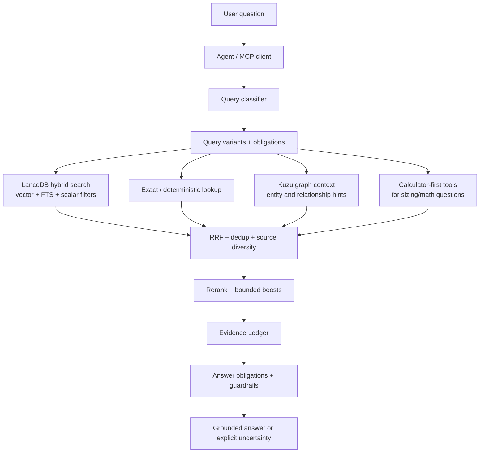

# NX-Shield RAG

**A field-tested design for building a trustworthy enterprise RAG system — not just a vector search demo.**

NX-Shield RAG is a public design notebook for a Nutanix-focused retrieval-augmented generation system. The implementation is private, but the architecture is documented here so other teams can copy the patterns: hybrid retrieval, source authority, graph context, calculator-first tooling, evidence-ledger answer synthesis, and profile-aware MCP serving.

> If you only remember one idea: **retrieval is not the product; evidence-bound answers are the product.**

## Why this repo exists

Most RAG examples stop at "embed documents and ask questions." That is not enough for technical support, presales, or partner-facing answers where hallucinations can cause real operational damage.

This repo documents how NX-Shield RAG is designed to answer questions with:

- **traceable evidence** instead of ungrounded prose,
- **multiple retrieval channels** instead of one vector lookup,
- **source authority and access policy** instead of a flat document pile,
- **calculator/tool-first paths** when deterministic math beats language-model guessing,
- **graph context** as structural signal, not as a replacement for evidence,
- **MCP service boundaries** so multiple agents can share the same RAG safely,
- **rebuild discipline** so the system can be recreated from private source and public docs.

## Sample query path

Example user question:

> Can you provide a detailed comparison of VMware Cloud Foundation (VCF) 9.1 and Nutanix AOS 7.5?


This is a comparison query, so the RAG path is deliberately different from a single factual lookup. The goal is not only to retrieve chunks, but to produce balanced evidence for both products and make weak coverage visible before answer generation.

### 1. Classify and plan

- Run a prompt-injection guard before retrieval.
- Classify the query as a competitive/comparison question with product/version entities such as `VCF 9.1`, `VMware Cloud Foundation`, `AOS 7.5`, and `Nutanix AOS`.
- Build answer obligations: compare architecture, lifecycle/upgrade model, operations, storage/virtualization assumptions, ecosystem dependencies, and caveats.
- Generate bounded query routes. In the current design, comparison routing preserves the original question at low weight and creates up to four focused routes, for example:
  - original full comparison question, low weight,
  - `VMware Cloud Foundation VCF 9.1 architecture operations lifecycle`,
  - `Nutanix AOS 7.5 architecture operations lifecycle`,
  - combined comparison route with expanded aliases.

### 2. Retrieve from local evidence first

For comparison mode, each route can run both semantic and lexical channels. With four routes, that is up to eight LanceDB channel searches:

```text
4 routes × (vector search + full-text search) = up to 8 LanceDB searches
```

The implementation keeps the fan-out bounded for latency:

- query embeddings are batched,
- LanceDB channels run concurrently,
- each channel is capped before fusion,
- scalar filters enforce access/source policy where applicable,
- exact keyword/ripgrep search runs in parallel as a Tier 1.5 lexical safety net.

### 3. Add graph context, but do not let graph become truth

In parallel with query planning, Kuzu is queried once for entity and relationship hints. For this sample, graph context might surface relationships among AOS, AHV, Prism, VCF, ESXi/vSphere, lifecycle tools, and storage concepts.

Graph matches can boost or annotate retrieved chunks, but they do not create answer claims by themselves. A graph edge is treated as structural signal; the final answer still needs source-backed evidence.

### 4. Fuse with RRF, then rerank

The LanceDB vector/FTS channels are fused with Reciprocal Rank Fusion (RRF):

- chunk-level keys prevent duplicate chunks from crowding the candidate set,
- route weights keep decomposed product-specific evidence above the broad original query,
- topic/source-authority multipliers are bounded so metadata helps but does not overpower relevance,
- source diversity is applied after semantic reranking so one document does not dominate the final answer.

The top fused candidates are then expanded with nearby chunk context and sent to a cross-encoder reranker. The private implementation uses a bounded rerank pool and returns a small final set, usually the top five evidence items, to keep answer latency and context size controlled.

### 5. Build the Evidence Ledger

Before final writing, the system summarizes what the evidence supports and what remains weak:

```yaml
answer_obligations:
  - compare VCF 9.1 and AOS 7.5 architecture
  - compare operations and lifecycle management
  - identify version-specific claims that need direct evidence
  - separate Nutanix evidence from VMware evidence

supported_claims:
  - source-backed claims from retrieved Nutanix docs, KBs, design guides, or comparison material
  - source-backed claims from allowed VMware/public references if local evidence is insufficient

weak_or_missing_claims:
  - any VCF 9.1-specific claim not directly supported by retrieved evidence
  - any AOS 7.5-specific claim where the evidence is adjacent but not exact

answer_rules:
  - do not present one-sided Nutanix evidence as a complete competitive comparison
  - mark unsupported version-specific statements as assumptions or items to verify
  - prefer concise comparison tables only after the evidence coverage is clear
```

### 6. Use Slack or Web only as fallbacks

The normal path is local evidence first. Slack and Web are waterfall fallbacks, not primary sources:

- Slack search is attempted only when local RAG and exact keyword evidence are weak or missing. It is useful for field notes, but lower authority than official docs.
- Web search is the final fallback and is constrained to allowed domains. It is useful for current public vendor pages or release notes when the local corpus lacks coverage.

### Measured sample run

The table below aligns the measured pipeline timing with the six conceptual phases above. This was one local-RAG run of the sample query with Slack and Web fallbacks disabled, so it should be read as an example execution trace rather than a fixed benchmark.

```text
Mode: COMPARISON
Routes: 4
Channels: 8
Candidates before rerank: 314
Rerank pool: 50
Final evidence items: 5
Total local RAG latency: 24.0128s
```

| README phase | What happens in this sample query | Evidence / scoring output | Booster / ranking behavior | Measured latency |
| --- | --- | --- | --- | ---: |
| **1. Classify and plan** | Prompt guard runs, then the query is classified as a competitive/comparison query. The router extracts product/version entities such as `VCF 9.1`, `VMware Cloud Foundation`, `AOS 7.5`, and `Nutanix AOS`, then creates up to four bounded routes. | Routing mode: `COMPARISON`; routes: `4`; topics observed include `LICENSING`, `CLUSTER_SIZING`, `STORAGE_EFFICIENCY`, and `FOUNDATION_IMAGING`. | Original full query is preserved at lower weight; product-specific comparison routes are weighted higher. Topic weights later influence RRF and post-rerank scoring. | `18.6647s`, shared with Phase 3 as `parallel_prep` |
| **2. Retrieve from local evidence first** | Batched embeddings are generated for the four route queries. LanceDB runs vector plus FTS retrieval per route, producing up to eight local retrieval channels. Exact/ripgrep side search also runs as a lexical safety net. | `314` chunk-level candidates before rerank. | Vector search provides semantic recall; FTS anchors exact product/version terms; route weights carry into RRF. | Embedding: `1.2166s`; LanceDB channels: `0.2828s`; LanceDB open: `0.0013s` |
| **3. Add graph context, but do not let graph become truth** | Kuzu graph lookup surfaces entity and relationship hints related to AOS, AHV, Prism, VCF, ESXi/vSphere, lifecycle, and storage concepts. | `540` graph entity types verified. All final top-five evidence items carried graph annotation. | Graph matches add bounded structural signal; graph does not create factual claims by itself. | Graph lookup is included in `parallel_prep`; graph boost application: `0.0146s` |
| **4. Fuse with RRF, then rerank** | Vector, FTS, and graph-annotated candidates are fused. Top fused candidates get nearby chunk context, then a cross-encoder reranks the top 50. | Rerank pool: `50`; final top evidence scores ranged from `0.732` to `0.200`. | RRF combines independent channels; chunk-level dedup prevents duplicate crowding; source/metadata multipliers are capped; source diversity is applied after rerank. | Context expansion: `0.1958s`; rerank: `3.6347s`; postprocess: `0.0022s`; RRF is included inside search-channel timing |
| **5. Build the Evidence Ledger** | Retrieved evidence is converted into supported claims, weak or missing claims, and answer rules before final answer synthesis. | Top evidence included Broadcom/VMware material, Nutanix competitive material, and AOS 7.5 portal evidence. | Weak coverage for exact `VCF 9.1` or exact `AOS 7.5` claims should be marked rather than overgeneralized. | Not separately timed in current instrumentation |
| **6. Use Slack or Web only as fallbacks** | Fallbacks are skipped when local evidence is strong enough. In this measurement, both were explicitly disabled to isolate local RAG latency. | No Slack or Web evidence included. | Slack is lower-authority field/community signal; Web is the final allowed-domain fallback for current public sources. Neither should override stronger local official evidence. | `0s` in this run because `--no-slack-search --no-web-search` was used |

Top evidence items from this measured run:

| Rank | Source | Graph annotation | Cross-encoder score | Final score |
| ---: | --- | --- | ---: | ---: |
| 1 | `broadcom-vmware/broadcom_vmware_converted.md` | yes | `0.554` | `0.732` |
| 2 | `xpress-md/Competitive_Cheat_Sheet_for_Nutanix_vs_VMware.md` | yes | `0.327` | `0.360` |
| 3 | `xpress-md/Broadcom_Compete_Technical_Discovery_Template.md` | yes | `0.249` | `0.273` |
| 4 | `xpress-md/Nutanix_Advantage_vs_Dell_VxRail_-_Competitive_Brief.md` | yes | `0.223` | `0.246` |
| 5 | `portal/AOS/vSphere-Admin6-AOS-v7_5_vSphere-Admin6-AOS-v7_5.txt` | yes | `0.137` | `0.200` |

### Techniques used to improve accuracy and latency

Accuracy controls:

- query classification plus deterministic keyword fallback,
- comparison-specific query decomposition,
- alias expansion for acronyms and product names,
- hybrid vector + full-text retrieval,
- scalar access/source filters,
- Kuzu graph hints as bounded boosts only,
- RRF fusion across independent channels,
- cross-encoder reranking,
- source-authority and metadata multipliers with caps,
- Evidence Ledger answer obligations and weak-evidence notes,
- explicit fallback policy for Slack and Web.

Latency controls:

- bounded route count,
- batched embeddings for all route queries,
- concurrent LanceDB channel searches,
- parallel graph lookup and exact keyword search,
- capped candidate fetch and rerank pools,
- context expansion only for fused top candidates,
- fallback waterfall so Slack/Web are skipped when local evidence is strong.

## The design in one diagram



## Start here

1. [Architecture overview](docs/design/architecture.md) — the full design at human scale.
2. [Retrieval pipeline](docs/design/retrieval-pipeline.md) — how a query becomes evidence.
3. [Evidence-ledger answers](docs/design/evidence-ledger.md) — the answer-quality contract.
4. [Ingestion and corpus design](docs/build/ingestion-and-corpus.md) — how content should enter the system.
5. [Rebuild from private source](docs/build/rebuild-from-private-source.md) — how to reconstruct the runtime from docs + private repo.
6. [Operations model](docs/operate/runtime-and-mcp.md) — profile-aware MCP serving and runtime boundaries.
7. [Evaluation strategy](docs/evaluate/evaluation-strategy.md) — canaries and regression classes.

## Repository map

```text
.
├── README.md
├── docs/
│   ├── design/       # architecture, retrieval, metadata, evidence, graph, security
│   ├── build/        # ingestion, rebuild, private-source mapping
│   ├── operate/      # runtime/MCP and operational playbooks
│   └── evaluate/     # eval strategy and milestone lineage
├── diagrams/         # portable Mermaid diagrams
├── templates/        # implementation-neutral templates
└── examples/         # example query obligations and answer ledgers
```

## Design principles

- **Evidence before eloquence.** Good style is secondary to source-grounded claims.
- **Hybrid retrieval by default.** Vector search, lexical search, exact matches, metadata filters, and graph hints solve different failure modes.
- **Structured uncertainty.** Weak evidence should produce a review/uncertain answer, not confident filler.
- **Deterministic tools outrank prose.** Storage sizing and arithmetic belong in calculators first, with RAG as supporting context.
- **Access policy is retrieval logic.** Public, partner, and internal corpora cannot be separated only at the final answer stage.
- **Graph is advisory.** Kuzu boosts and explains relationships; it does not make unsupported facts true.
- **Rebuildability matters.** Every major runtime concept should map to a private script/config path and an external data backup requirement.

## Status

This repo intentionally avoids live counts, private hostnames, internal paths, tokens, and operational secrets. Treat all diagrams and paths as design-level unless the rebuild docs explicitly point to the private source bundle.
