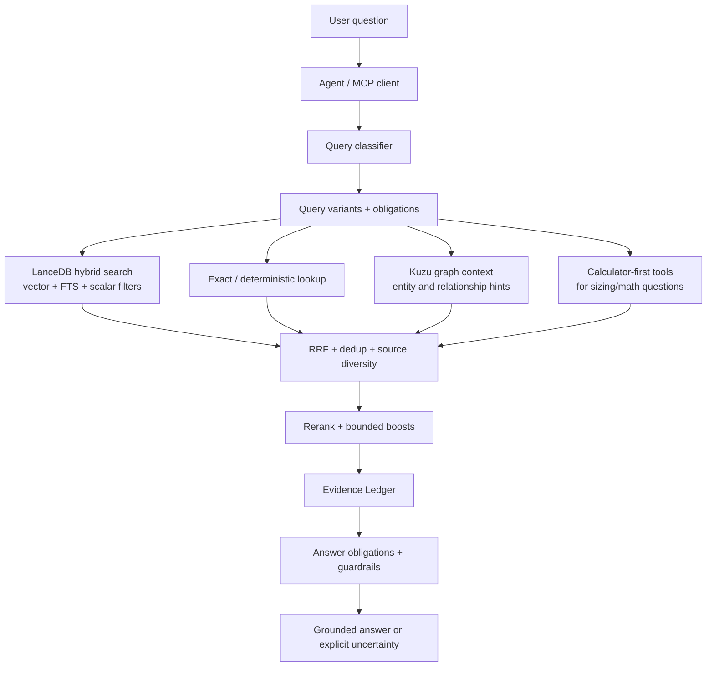

# NX-Shield RAG

**A field-tested design for building a trustworthy enterprise RAG system — not just a vector search demo.**

NX-Shield RAG is a public design notebook for a Nutanix-focused retrieval-augmented generation system. The implementation is private, but the architecture is documented here so other teams can copy the patterns: hybrid retrieval, source authority, graph context, calculator-first tooling, evidence-ledger answer synthesis, and profile-aware MCP serving.

> If you only remember one idea: **retrieval is not the product; evidence-bound answers are the product.**

## Why this repo exists

Most RAG examples stop at "embed documents and ask questions." That is not enough for technical support, presales, or partner-facing answers where hallucinations can cause real operational damage.

This repo documents how NX-Shield RAG is designed to answer questions with:

- **traceable evidence** instead of ungrounded prose,
- **multiple retrieval channels** instead of one vector lookup,
- **source authority and access policy** instead of a flat document pile,
- **calculator/tool-first paths** when deterministic math beats language-model guessing,
- **graph context** as structural signal, not as a replacement for evidence,
- **MCP service boundaries** so multiple agents can share the same RAG safely,
- **rebuild discipline** so the system can be recreated from private source and public docs.

## What is public vs private

This public repository is the **design and rebuild documentation**.

The private companion repository `ipccheng/NX-Shield-RAG-src` stores the source-recovery bundle: scripts, sanitized prompt/profile files, LaunchAgent templates, and implementation reports. It intentionally excludes secrets and large data stores.

| Layer | Public repo | Private source repo | External backups |
|---|---|---|---|
| Architecture/design | yes | yes | optional |
| Rebuild runbook | yes | yes | optional |
| Scripts/config templates | mapped here | yes | optional |
| Credentials/tokens | no | no | secure vault only |
| LanceDB/Kuzu/source-doc data | no | no | backup artifacts only |
| Private operational logs | no | limited sanitized reports | backup artifacts only |

## The design in one diagram



## Start here

1. [Architecture overview](docs/design/architecture.md) — the full design at human scale.
2. [Retrieval pipeline](docs/design/retrieval-pipeline.md) — how a query becomes evidence.
3. [Evidence-ledger answers](docs/design/evidence-ledger.md) — the answer-quality contract.
4. [Ingestion and corpus design](docs/build/ingestion-and-corpus.md) — how content should enter the system.
5. [Rebuild from private source](docs/build/rebuild-from-private-source.md) — how to reconstruct the runtime from docs + private repo.
6. [Operations model](docs/operate/runtime-and-mcp.md) — profile-aware MCP serving and runtime boundaries.
7. [Evaluation strategy](docs/evaluate/evaluation-strategy.md) — canaries and regression classes.

## Repository map

```text
.
├── README.md
├── docs/
│   ├── design/       # architecture, retrieval, metadata, evidence, graph, security
│   ├── build/        # ingestion, rebuild, private-source mapping
│   ├── operate/      # runtime/MCP and operational playbooks
│   └── evaluate/     # eval strategy and milestone lineage
├── diagrams/         # portable Mermaid diagrams
├── templates/        # implementation-neutral templates
└── examples/         # example query obligations and answer ledgers
```

## Design principles

- **Evidence before eloquence.** Good style is secondary to source-grounded claims.
- **Hybrid retrieval by default.** Vector search, lexical search, exact matches, metadata filters, and graph hints solve different failure modes.
- **Structured uncertainty.** Weak evidence should produce a review/uncertain answer, not confident filler.
- **Deterministic tools outrank prose.** Storage sizing and arithmetic belong in calculators first, with RAG as supporting context.
- **Access policy is retrieval logic.** Public, partner, and internal corpora cannot be separated only at the final answer stage.
- **Graph is advisory.** Kuzu boosts and explains relationships; it does not make unsupported facts true.
- **Rebuildability matters.** Every major runtime concept should map to a private script/config path and an external data backup requirement.

## What to copy for your own RAG

If you are building your own enterprise RAG, copy these patterns first:

1. **Answer Obligations** — decompose the user question before retrieval.
2. **Evidence Ledger** — summarize what each source supports before writing the final answer.
3. **Source Authority** — rank official docs, KBs, design guides, community notes, and chat differently.
4. **Metadata-first filters** — access level, product, version, source family, and document identity should be queryable fields.
5. **Canary suites** — evaluate the actual answer path, not only top-k retrieval.
6. **Private/public split** — publish design docs; keep scripts, data, and credentials in the right place.

## Status

This repo intentionally avoids live counts, private hostnames, internal paths, tokens, and operational secrets. Treat all diagrams and paths as design-level unless the rebuild docs explicitly point to the private source bundle.
