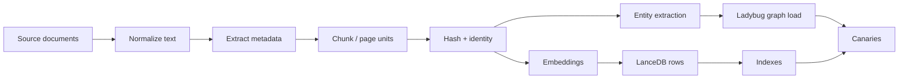

# Ingestion and Corpus Build

The ingestion pipeline should produce a searchable, policy-aware corpus — not just chunks.

## Target output

Each ingested unit should have:

- clean text,
- source identity,
- document and section identity,
- product/version metadata,
- source family and authority,
- access/confidentiality class,
- stable hashes,
- embedding vector,
- lexical-search text,
- optional graph/entity extraction output,
- governance metadata such as approved use scope, owner, review status, and retention/removal expectations where applicable.

## Recommended stages



## Source normalization

Normalize sources before embedding:

- preserve headings and section hierarchy,
- keep URLs/document IDs,
- remove navigation boilerplate,
- record version/product context,
- avoid mixing multiple documents into one anonymous text blob.

Before ingestion, also record whether the source is approved for the intended RAG use. Treat licensing, data classification, personal/customer/partner data, source-code or telemetry content, and third-party analyst material as approval gates, not as after-the-fact cleanup.

## Layered authoritative-source capture

Authenticated documentation portals often expose more than one useful representation of the same authority. A reproducible capture should preserve the available layers separately rather than flattening them into one anonymous scrape:

1. inventory/search metadata used to select the current document;
2. canonical document identity and publication metadata;
3. structured generated-document content, including recursive section hierarchy;
4. canonical PDF or other published artifact when available;
5. page/section text extracted with explicit quality checks;
6. provenance manifest and checksums tying every derived chunk back to its source layer.

Require complete identities, non-empty leaf sections, bounded chunks, and deterministic source hashes before embedding. A title match or incidental paragraph already present in the corpus is not proof that the complete current authority has been ingested.

## Chunking strategy

Use chunking that respects source structure. For technical docs, headings and sections often matter more than arbitrary token windows.

Good chunks should be:

- small enough for precise retrieval,
- large enough to contain procedure context,
- linked to parent document/section,
- stable across rebuilds where possible.

## Indexes

A mature RAG store usually needs:

- vector index for semantic recall,
- FTS index for exact terms,
- scalar indexes for source family/access/product/version,
- stable identity fields for deduplication.

The current unified v4 LanceDB contract uses one embedding vector column, one lexical `search_text` column, and scalar indexes over identity, source, access, version, and lineage fields. The public-safe schema is documented in [LanceDB schema](../design/lancedb-schema.md).

Benchmark before adding indexes. Index churn without measured need can complicate rebuilds.

## Controlled corpus promotion

Treat a corpus update as a candidate promotion, not as an in-place write to the active store:

1. freeze the source and provenance bundle;
2. build typed rows in an isolated stage;
3. reconcile exact document, section, URL, hash, and body identities against the active corpus;
4. build a candidate by preserving qualified existing indexes and indexing only the incoming delta where practical;
5. validate new-document retrieval, exact-ID behavior, source/access policy, ranking preservation, and graph linkage;
6. compare logical vector and graph state across every serving host;
7. freeze a promotion binding to the exact candidate and rollback artifacts;
8. quiesce only the affected services, promote atomically, restart, and run fresh direct and profile-level canaries;
9. roll back automatically if any required gate fails.

Rebuilding every index can change approximate-nearest-neighbor ordering even when row content is unchanged. Prefer an incremental/index-preserving candidate when it passes both new-content retrieval and frozen preservation canaries. Keep historical rows unless an independently reviewed deletion policy explicitly authorizes physical removal.

## Private source mapping

Private source files that correspond to ingestion:

```text
ipccheng/NX-Shield-RAG-src
├── rag/hermes-nutanix/ingestion/
├── rag/hermes-nutanix/ingestion/openclaw_pipeline/
├── rag/hermes-nutanix/ingestion/tagger_v3.py
└── rag/hermes-nutanix/runtime/ladybug-graph-probe/scripts/ladybug_graph_probe.py
```

These paths are implementation references, not public dependencies.
