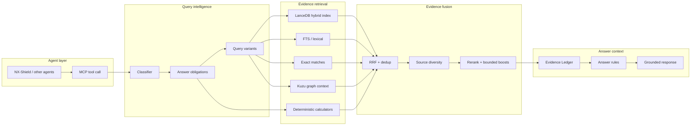

# Architecture Overview

NX-Shield RAG is organized around one operational goal:

> Turn a user question into a small, source-traceable evidence packet that an agent can safely answer from.

The system is not a single retriever. It is a set of cooperating layers:

1. **Question understanding** — classify risk, intent, product family, and answer obligations.
2. **Retrieval planning** — generate variants and choose retrieval channels.
3. **Hybrid evidence gathering** — combine LanceDB vector/FTS/scalar filters, exact lookup, graph context, and deterministic tools.
4. **Evidence fusion** — deduplicate, diversify, rerank, and score without letting one noisy source dominate.
5. **Evidence ledger** — expose what is known, weak, missing, or risky.
6. **Answer guardrails** — force source-traceable claims and explicit uncertainty.
7. **Profile-aware serving** — use MCP endpoints so different agents can share the RAG with different policies.

## Component model

## Why the layers exist

### Classifier

The classifier decides whether the query is about troubleshooting, comparison, sizing, hardware, networking, licensing, version support, or general explanation. The classification changes retrieval strategy and answer strictness.

### Answer obligations

A question often contains multiple obligations. Example:

> "Can I replace this NIC, and what must I configure after replacement?"

Obligations might be:

- hardware compatibility evidence,
- AOS/Prism procedure evidence,
- networking risk/caveats,
- step-by-step change checklist,
- uncertainty disclosure if the exact part is not documented.

The final answer should cover those obligations only when evidence supports them.

### LanceDB-centered corpus

LanceDB is the center because it holds the searchable corpus and metadata used by vector, lexical, scalar, and source-policy filters. The active setup uses a unified v4 corpus concept: native/current rows plus transformed legacy evidence with lineage metadata. The public-safe table contract is documented in [LanceDB schema](lancedb-schema.md).

The important implementation detail is not the live row count; it is the contract: every row must carry source authority, access policy, product/version metadata, stable identity, search text, an embedding vector, and lineage. This lets the runtime prefer official Portal refresh rows, preserve exact KB lookups, route comparison queries to competitive collateral when appropriate, and still keep older migrated evidence auditable.

### Kuzu graph context

Kuzu stores entities and relationships so retrieval can notice structural proximity: products, features, errors, KBs, hardware families, and related concepts. It is a recall and explanation aid, not a primary truth store.

### Calculator-first tools

For sizing and arithmetic, deterministic calculators should run before prose generation. RAG then explains assumptions, terminology, and constraints.

### Evidence Ledger

The ledger is the handoff between retrieval and answer generation. It should make unsupported claims obvious before the model writes a confident answer.

## Data/control separation

- **Public design docs** live here.
- **Private source scripts** live in `ipccheng/NX-Shield-RAG-src`.
- **Large RAG data stores** live in backups, not Git.
- **Secrets** live only in a credential vault or local env files.

This separation is part of the architecture. A public repo should teach the design without becoming an accidental data leak.
