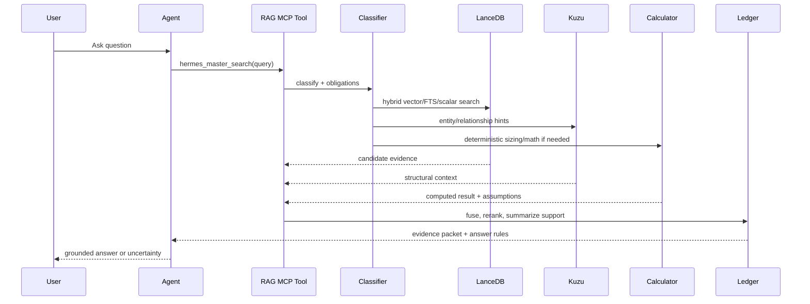

# Retrieval Pipeline

The retrieval pipeline is designed to answer hard technical questions where the right answer may require multiple evidence families.

## Query flow



## Retrieval channels

### 1. Vector search

Best for semantic recall: paraphrases, conceptual questions, and product descriptions.

Failure mode: can retrieve plausible-but-wrong chunks when terminology overlaps.

### 2. Full-text search

Best for exact product names, error strings, CLI commands, part numbers, KB IDs, versions, and acronyms.

Failure mode: misses paraphrases and semantic matches.

### 3. Scalar metadata filters

Best for enforcing policy and narrowing scope:

- source family,
- access/confidentiality class,
- product family,
- version,
- migration/source lineage,
- document or section identity.

Failure mode: bad metadata can hide useful evidence, so schema audits matter.

### 4. Exact/deterministic lookup

Best for serial-like identifiers, KB numbers, known config keys, and hard-coded product aliases.

Failure mode: brittle when the identifier is absent or normalized differently.

### 5. Graph context

Best for expanding or explaining entity relationships.

Failure mode: graph proximity is not answer sufficiency.

### 6. Calculator/tool path

Best for sizing, usable capacity, RF/FT calculations, and repeatable math.

Failure mode: wrong assumptions. The answer must state assumptions and use RAG for context.

## Fusion strategy

A useful pipeline should not just concatenate results. NX-Shield uses these ideas:

- **RRF-style fusion** so independently strong channels rise.
- **Deduplication** by chunk/document identity so one source does not crowd the result set.
- **Source diversity** so official docs, KBs, design guides, and related references can coexist.
- **Bounded boosts** so metadata/source authority helps ranking without overpowering actual relevance.
- **Weak-evidence detection** so one-sided or low-authority evidence triggers caution.

## Output contract

The retrieval layer should return a packet like this:

```text
query_class: networking_production_impacting
verdict: review
answer_obligations:
  - compatibility evidence
  - post-change configuration steps
  - operational risk/caveats
evidence_ledger:
  supported:
    - Hardware guide mentions supported NIC family.
    - Network guide describes host/CVM uplink reconfiguration.
  weak_or_missing:
    - Exact customer part replacement path not found.
answer_rule:
  - Cite evidence for each procedural step.
  - Do not imply compatibility if source only supports adjacent model.
  - If exact evidence is missing, say so.
```

The language model should answer from this packet, not from vague memory.
